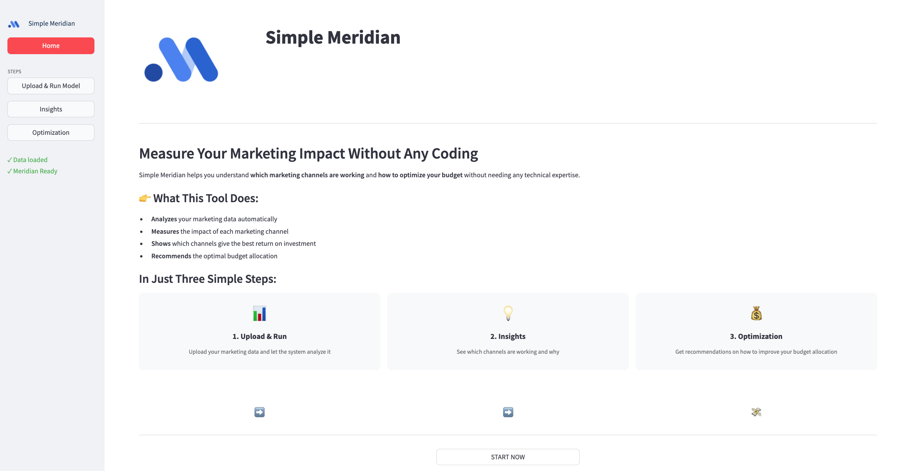

# Simple Meridian

<div align="center">
  
  <p>
    <a href="#Overview">Overview</a> •
    <a href="#how-it-works">How It Works</a> •
    <a href="#getting-started">Getting Started</a> •
    <a href="#data-requirements">Data Requirements</a> •
    <a href="#built-with">Built With</a>
  </p>
</div>

## Overview

<div align="center">
  
</div>
The Meridian Zero Code App revolutionizes how data scientists and marketers work with Google's powerful Marketing Mix Modeling (MMM) framework. This elegant Streamlit interface eliminates the need to write a single line of code while delivering professional-grade analytics capabilities.

Simple Meridian is a no-code application that makes powerful marketing analytics accessible to everyone. With just a few clicks, you can analyze your marketing effectiveness, understand which channels drive results, and optimize your budget allocation for maximum ROI.

<div align="center">
  
</div>

## Key Features

- **Zero Coding Required** — Upload your data and click through our intuitive interface
- **Automatic Data Analysis** — Built on Google's Meridian framework for reliable results
- **Channel Effectiveness** — See exactly which marketing channels drive the most value
- **Budget Optimization** — Get AI-powered recommendations to maximize your ROI
- **Interactive Visualizations** — Explore your data through beautiful charts and graphs
- **Shareable Reports** — Export professional reports to share with your team

## How It Works

<div align="center">
  <table>
    <tr>
      <td align="center">
        <div style="background-color: #4285f4; color: white; width: 36px; height: 36px; border-radius: 50%; display: inline-flex; align-items: center; justify-content: center; margin-bottom: 10px;">1</div><br>
        <b>Upload & Run</b><br>
        <i class="fas fa-upload fa-3x" style="color: #4285f4;"></i><br>
        Upload your marketing data and run the analysis with a single click
      </td>
      <td align="center">
        <div style="background-color: #4285f4; color: white; width: 36px; height: 36px; border-radius: 50%; display: inline-flex; align-items: center; justify-content: center; margin-bottom: 10px;">2</div><br>
        <b>Explore Insights</b><br>
        <i class="fas fa-search fa-3x" style="color: #4285f4;"></i><br>
        View interactive visualizations showing which channels perform best
      </td>
      <td align="center">
        <div style="background-color: #4285f4; color: white; width: 36px; height: 36px; border-radius: 50%; display: inline-flex; align-items: center; justify-content: center; margin-bottom: 10px;">3</div><br>
        <b>Optimize Budget</b><br>
        <i class="fas fa-chart-line fa-3x" style="color: #4285f4;"></i><br>
        Get recommendations for ideal budget allocation across channels
      </td>
    </tr>
  </table>
</div>

### Prerequisites

- Python 3.11+
- Streamlit 1.28.0+
- Google Meridian 1.0.6+
- Other dependencies listed in `requirements.txt`

### Installation

```bash
# Clone the repository
https://github.com/alibb007/Simple-Meridian.git
cd Simple-Meridian

# Create virtual environment
python -m venv venv
source venv/bin/activate  # On Windows: venv\Scripts\activate

# Install dependencies
pip install -r requirements.txt

# Launch the app
streamlit run app.py
```

### Docker Installation

```bash
# Build the Docker image
docker build -t simple-meridian .

# Run the container
docker run -p 8501:8501 simple-meridian
```

## Data Requirements

For best results, your data should include:

- **Time Series Data** : Weekly or monthly periods (at least 6 months of data)
- **Target KPI** : Sales, revenue, or conversions you want to analyze
- **Marketing Channels** : Spend amounts and/or metrics (impressions, clicks, etc.)
- **Control Variables** (optional): Seasonality, pricing, promotions, etc.

A sample dataset is included to help you get started quickly.

## What is Marketing Mix Modeling?

Marketing Mix Modeling (MMM) is a powerful analysis technique that helps you understand how your marketing activities affect your business results.

Simple Meridian answers critical questions like:

- **Which channels drive the most sales?** Identify your top performers
- **What's the ROI for each activity?** Measure the return on every dollar spent
- **How should I allocate my budget?** Optimize spending across channels
- **What if I shift budget between channels?** Forecast the impact of changes

Simple Meridian uses Google's advanced MMM technology with an interface that anyone can use—no coding required!

## Built With

<div align="center">
  
  
  
  
  
</div>
<div align="center" style="margin-top: 10px;">
  
  
  
  
</div>
<div align="center" style="margin-top: 10px;">
  
  
</div>
<div align="center">
  
</div>
<div align="center">
  <h3>Ali Barfi Bafghi</h3>
  <p>Data Scientist & Marketing Analytics Expert</p>
<a href="https://github.com/alibb007"></a>
<a href="https://www.linkedin.com/in/alibarfibafghi/"></a>
<a href="mailto:ali.barfib@gmail.com"></a>

## </div>

---

<div align="center">
  <p><i>Simple Meridian uses the open-source Google Meridian library. All rights and trademarks remain with Google.</i></p>
</div>
